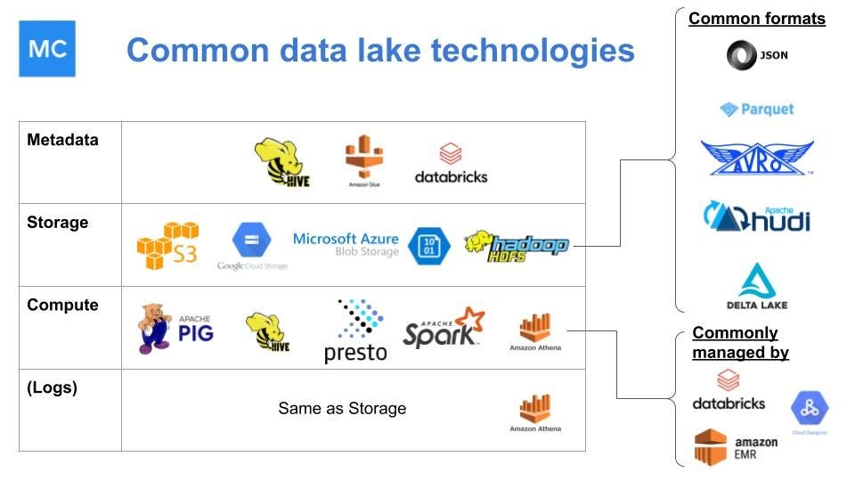
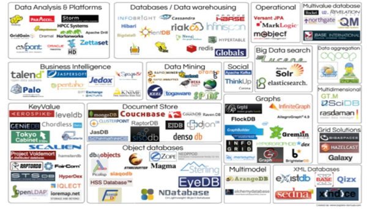
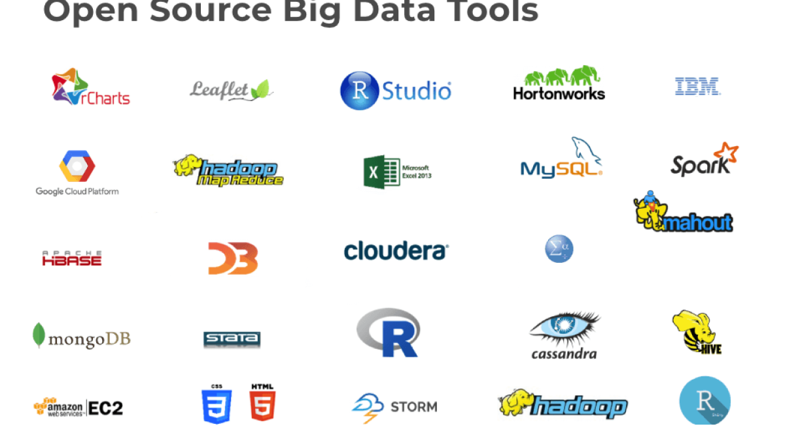
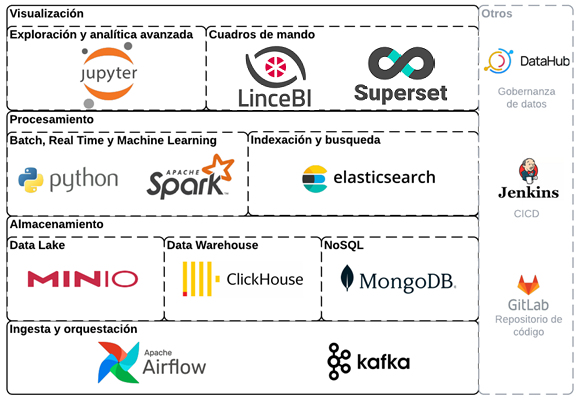

# open-source-data-ecosystem

visualización:
	lincebi
	superset
procesamiento:
	python
	apache spark
	elasticsearch
data lake:
	minio
lakefs
data wharehouse:
	click house
nosql:
	mongodb
orquetación:
	airflow
	kubernetes
streaming:
	kafka
gobernanza/catalogo:
	data-hub
	apache atlas
	amundsen
	marquez
	open metadata
	metacat
	datagovernance catalog
cicd:
	jenkins
repositorio:
	gitlab
api:
	graphql
cache:
	memcached
infraestructure as code:
	opentofu (terraform fork)
containers:
	docker
	apache mesos
	oks (open-source alternative to OpenShift)
	operator hub
file formats:
	parquet
	apache iceberg
monitoreo de redes y servidores:
	nagios
	zabbix
	icinga (bifurcación de nagios)
	prometheus
procesamiento
	apache spark
	apache flink
	apache beam
motor de consultas sql
	presto
web server:
	nginx

apache arrow (?)

https://www.mongodb.com/lp/cloud/atlas/try4?utm_source=google&utm_campaign=search_gs_pl_evergreen_atlas_core-high-int_prosp-brand_gic-null_amers-cl_ps-all_desktop_eng_lead&utm_term=mongodb%20atlas&utm_medium=cpc_paid_search&utm_ad=e&utm_ad_campaign_id=19637957473&adgroup=146511571660&cq_cmp=19637957473&gad_source=1&gclid=CjwKCAjw5v2wBhBrEiwAXDDoJWNfnPyagNiPbNyNIkh9yX4p-qehvV3a0gTAsny6CtsfUxRmTbD_pxoCFrgQAvD_BwE

https://travis.media/udemy/

https://github.com/Icinga

https://icinga.com/community/open-source

https://prometheus.io/

https://techbeacon.com/devops/top-5-open-source-tools-containerization

https://hub.docker.com/_/redis

https://redis.io/solutions/caching/

https://memcached.org/

https://en.wikipedia.org/wiki/Redis

https://www.youtube.com/watch?v=q--_5p15HnU

https://www.udemy.com/course/certified-kubernetes-administrator-with-practice-tests/?ranMID=39197&ranEAID=byQ1B*3xS1w&ranSiteID=byQ1B.3xS1w-OvBcSwrz6suAZhV_hO_PjA&utm_source=aff-campaign&LSNPUBID=byQ1B*3xS1w&utm_medium=udemyads

https://www.youtube.com/watch?v=s_o8dwzRlu4

https://www.youtube.com/watch?v=IPvYjXCsTg8

https://www.youtube.com/watch?v=wXuSqFJVNQA

https://www.youtube.com/watch?v=PziYflu8cB8

https://clickhouse.com/

https://min.io/solutions/modern-data-lakes-lakehouses

https://datahub.io/

https://datahubproject.io/

https://superset.apache.org/

https://lincebi.com/

